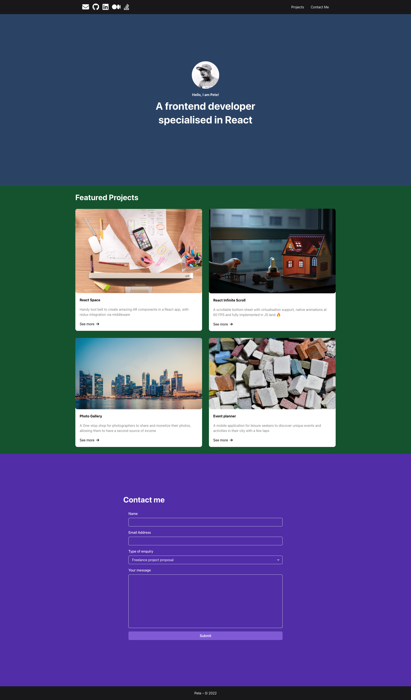
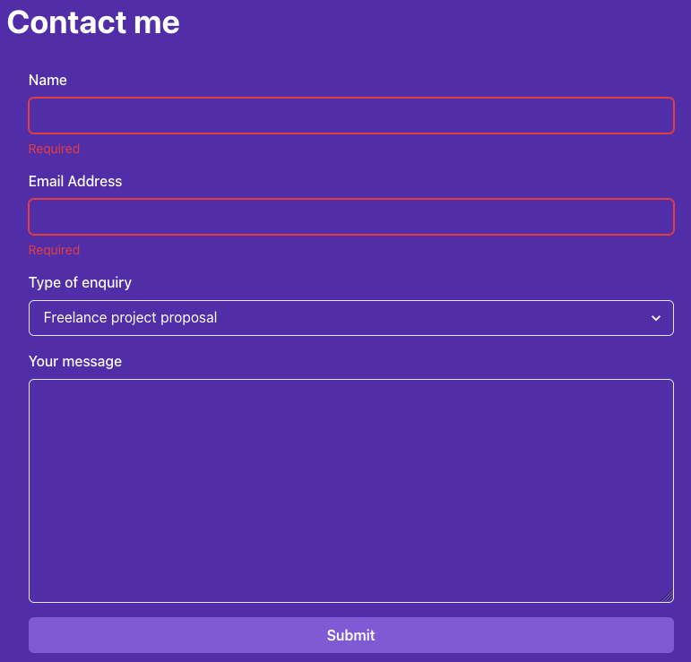
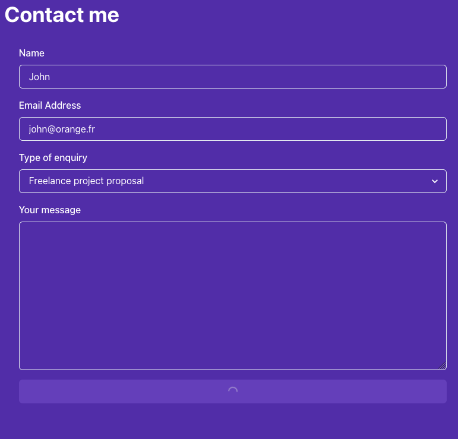
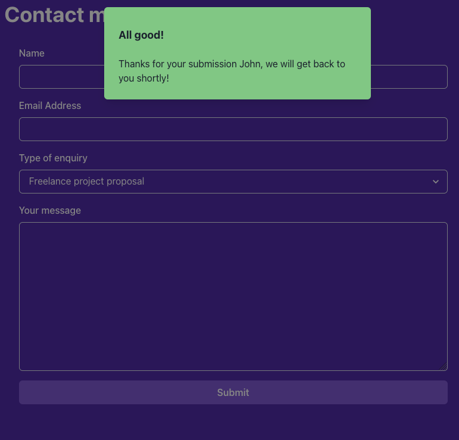
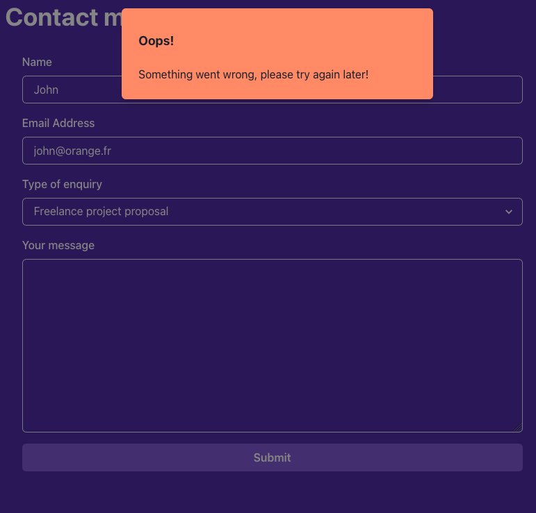

# Requirements

Install locally [Node.js](https://nodejs.org/en/learn/getting-started/how-to-install-nodejs) or [NVM](https://github.com/nvm-sh/nvm?tab=readme-ov-file#installing-and-updating) (recommended)

For NVM, follow this [additional configuration](https://github.com/nvm-sh/nvm?tab=readme-ov-file#zsh) to enable nvm automatically switch to the right Node.js project specific version.

Required Node.Js version is set inside [.nvmrc](.nvmrc) file

## Available Scripts

In the project directory, you can run:

### `npm start`

Runs the app in the development mode.\
Open [http://localhost:3000](http://localhost:3000) to view it in your browser.

The page will reload when you make changes.\
You may also see any lint errors in the console.

## Live Demo

https://gmocquet.github.io/coursera-react-advanced-portfolio-project/

## Demo

<video autoplay loop muted>
    <source src="docs/mov/demo.mp4" type="video/mp4" />
</video>

https://github.com/gmocquet/coursera-react-advanced-portfolio-project/assets/1082289/8cda8a04-adf9-4fe0-9003-f500304c933f

## Samples

Initialization 

Form fields validation KO 

Form submit loading 

Form submit OK 

Form submit KO 

